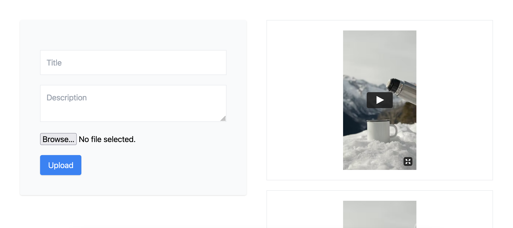

# Laravel Vimeo




## Installation

Clone the repo locally:

```
git clone https://github.com/tmh-team/laravel-vimeo.git

cd laravel-vimeo
```

Install PHP dependencies:

```
composer install
```

Setup configuration:

```
cp .env.example .env
```

Generate application key:

```
php artisan key:generate
```

Create database and configure in `.env` file

eg.

```
DB_CONNECTION=mysql
DB_HOST=127.0.0.1
DB_PORT=3306
DB_DATABASE=laravel_vimeo
DB_USERNAME=root
DB_PASSWORD=
```

Run database migrations:

```
php artisan migrate
```

Run the dev server:

```
php artisan serve
```

Visit `localhost:8000` in your **browser**